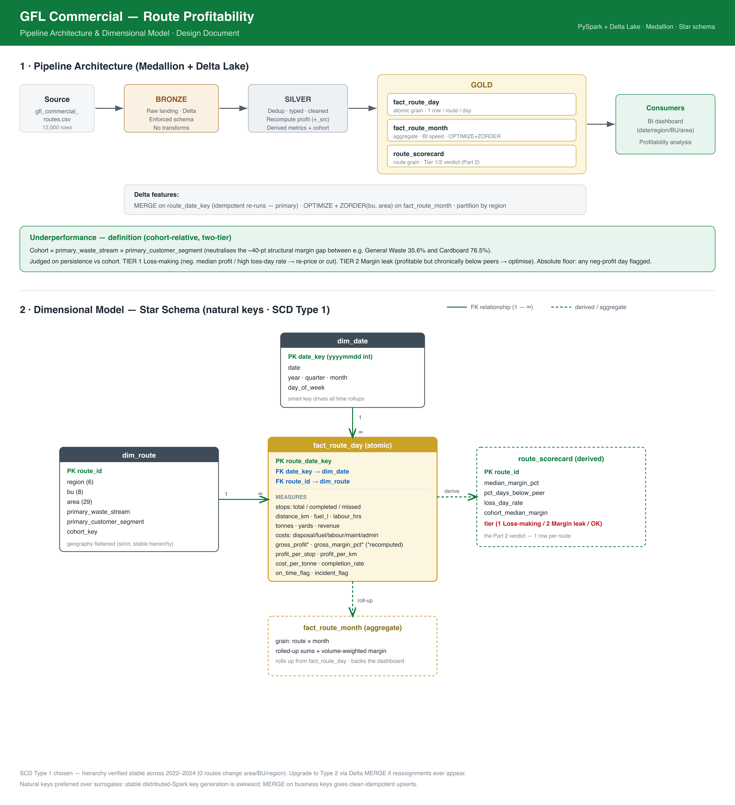

# GFL Commercial — Route Profitability

A PySpark + Delta Lake pipeline that turns raw route-day records into a clean
star schema and answers a leadership question: **which collection routes are
underperforming, and why** — without being fooled by the fact that different
waste streams have structurally different margins.

- **Part 1 — Pipeline:** a medallion (Bronze → Silver → Gold) build on Delta Lake.
- **Part 2 — Verdict:** `route_scorecard`, a per-route Tier 1 / Tier 2 rating.

Design rationale lives in [`docs/spec.md`](docs/spec.md); the build log with
per-task acceptance checks is [`docs/tasks.md`](docs/tasks.md).



*Pipeline architecture and the star-schema ERD.*

---

## Quickstart

The source data (`data/gfl_commercial_routes.csv`, 12,000 route-days) is committed,
so the pipeline is clone-and-run.

### Option A — Docker (no local Java/Python needed)

```bash
docker compose run --rm pipeline      # builds the full lakehouse
docker compose up jupyter             # explore the analysis at http://localhost:8888
```

No Docker Desktop required — this is verified with [Colima](https://github.com/abiosoft/colima):

```bash
brew install colima docker docker-compose
colima start --cpu 4 --memory 6
```

### Option B — Native (macOS, Homebrew)

```bash
brew install openjdk@17               # Spark needs a JVM (17)
python3 -m venv .venv
.venv/bin/pip install -r requirements.txt
.venv/bin/python -m pipeline            # Bronze -> Silver -> Gold, ~13s
```

`lib/config.py` auto-resolves `JAVA_HOME` to the Homebrew JDK, so no env setup is
needed. To view the analysis notebook:

```bash
PYTHONPATH=$PWD .venv/bin/jupyter lab notebooks/analysis.ipynb
```

The pipeline is **idempotent** — re-running upserts via Delta `MERGE` and leaves
row counts unchanged.

---

## What you get

Running the pipeline produces Delta tables under `data/lakehouse/`:

| Layer  | Table              | Grain            | Rows   |
|--------|--------------------|------------------|--------|
| Bronze | `route_day`        | raw route-day    | 12,000 |
| Silver | `route_day`        | clean route-day  | 12,000 |
| Gold   | `dim_route`        | route            | 120    |
| Gold   | `dim_date`         | date             | 1,012  |
| Gold   | `fact_route_day`   | route × day      | 12,000 |
| Gold   | `fact_route_month` | route × month    | 4,035  |
| Gold   | `route_scorecard`  | route + verdict  | 120    |

### Headline results

- Margins are **structural**: General Waste medians **35.6%** vs Cardboard **76.5%**
  — a ~40-point gap that reflects the material, not route operation. So routes are
  benchmarked **within a cohort** (`waste_stream × customer_segment`), not against a
  flat threshold.
- Underperformance is **concentrated**: **22 of 120** routes sit below their cohort
  on >70% of their days → **4 Tier 1** (loss-making: re-price or cut) + **18 Tier 2**
  (margin leak: optimise) + **98 OK**.
- The losses are **structural, not episodic**: of 717 loss-days (6%), only **3.5%**
  carry an incident and maintenance cost is in line with normal days.

See [`notebooks/analysis.ipynb`](notebooks/analysis.ipynb) for the full evidence.

---

## Output

The pipeline's results are captured in [`output/`](output/):

| File | Contents |
|---|---|
| [`findings.md`](output/findings.md) | **The verdict** — write-up of the Tier 1/2 findings and recommendations |
| [`analysis.html`](output/analysis.html) | Rendered analysis notebook (full evidence) |
| [`route_scorecard.csv`](output/route_scorecard.csv) | All 120 routes with their tier verdict |
| [`underperforming_routes.csv`](output/underperforming_routes.csv) | The 22 flagged routes |
| [`cohort_margins.csv`](output/cohort_margins.csv) | Median margin per cohort (peer benchmark) |
| [`waste_stream_margins.csv`](output/waste_stream_margins.csv) | Median margin by waste stream (the structural gap) |

---

## How it works

- **Bronze** — raw CSV → Delta under a hand-written, *enforced* schema (FAILFAST):
  a malformed file fails loudly. Adds ingestion metadata (`_ingested_at`, `_source_file`);
  no transforms. (Full list of engineered columns: [`docs/spec.md`](docs/spec.md#engineered-columns-added-beyond-the-39-source-columns).)
- **Silver** — one trustworthy row per `route_date_key`: dedup, quarantine bad rows,
  guard every division, and **recompute** `net_revenue` / `gross_profit` /
  `gross_margin_pct` from cost components (keeping source as `*_src` + a `recon_flag`).
- **Gold** — star schema with natural keys and SCD Type 1 (the geography hierarchy is
  verified stable, so flattening is safe). `fact_route_month` is partitioned by
  `region` with `OPTIMIZE` + `ZORDER(bu, area)`. `route_scorecard` is the Part 2 verdict.

The primary Delta feature throughout is **MERGE on the business key**, which makes
every re-run idempotent.

---

## Repo layout

```
data/gfl_commercial_routes.csv   committed source (12,000 rows)
lib/config.py                    paths + Spark/Delta session + logging + MERGE helper
lib/scorecard.py                 Part 2 verdict (analytics output)
src/bronze.py  silver.py         ingestion + cleaning
src/gold_dims.py  gold_facts.py  star schema
pipeline/__main__.py             end-to-end driver (run: python -m pipeline)
notebooks/analysis.ipynb         Part 2 evidence (executed)
docs/spec.md  design.svg  design.png  tasks.md
Dockerfile  docker-compose.yml
```

## Requirements

PySpark 3.5.1, delta-spark 3.2.0, Java 17 (see `requirements.txt`). Docker users
need nothing else.
